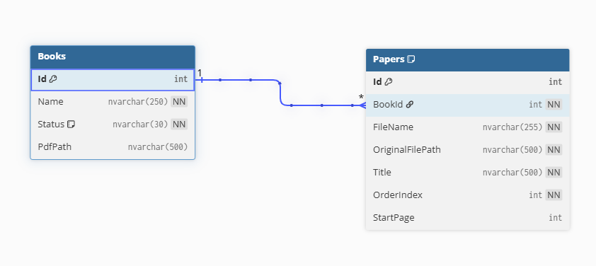
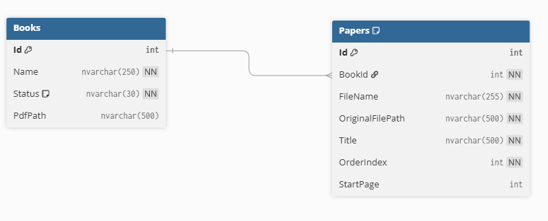
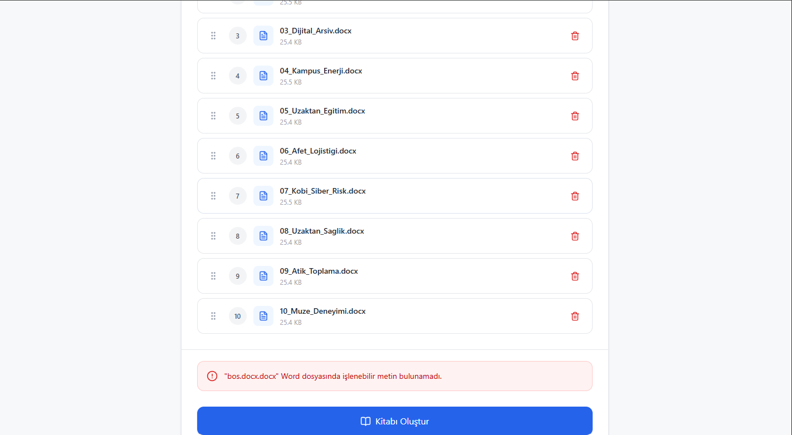
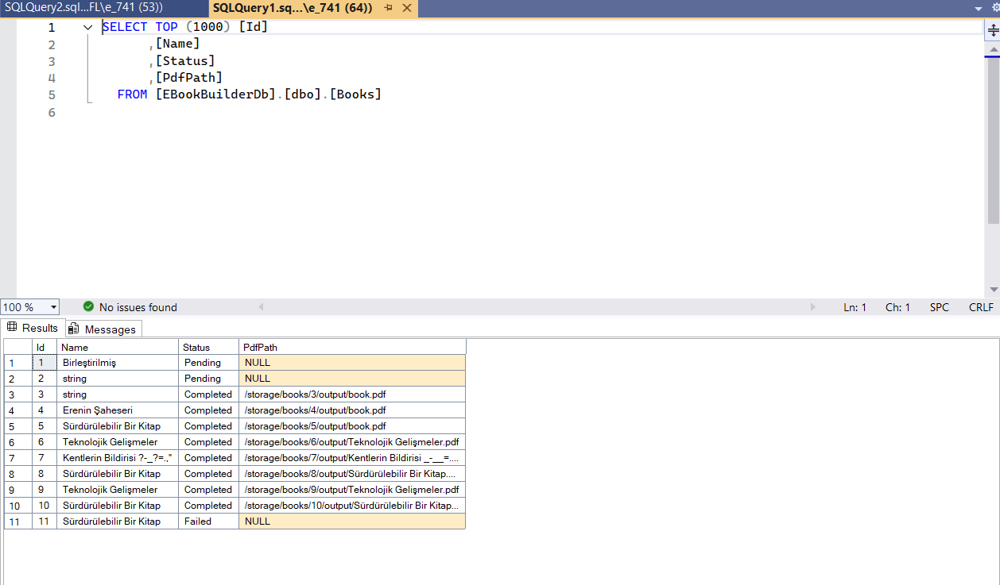
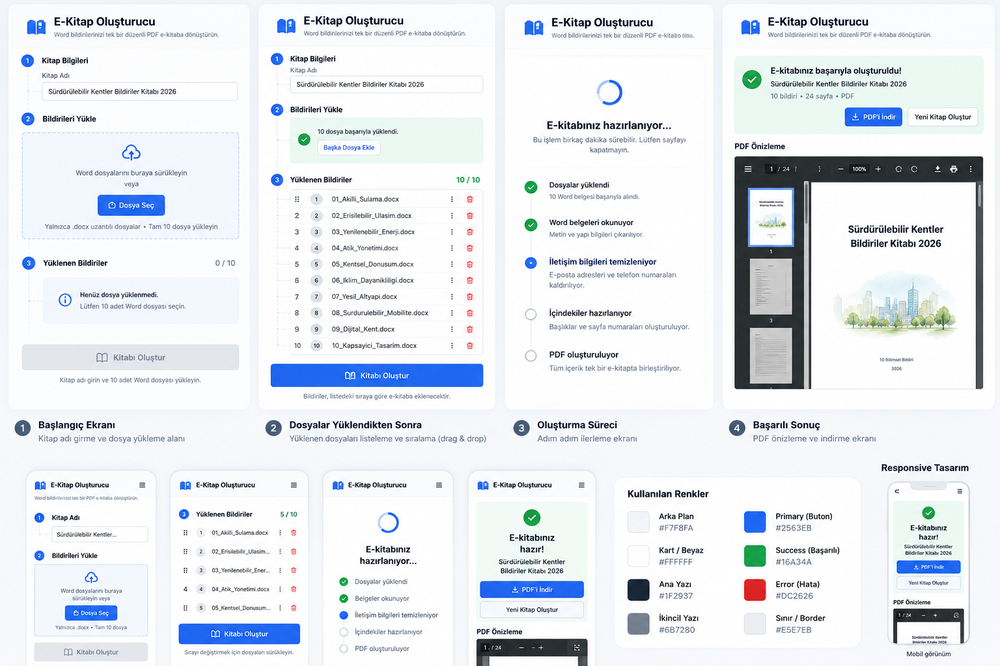

# E-Kitap Oluşturucu

Word formatındaki 10 farklı dokümanı belirlenen sıraya göre birleştirerek tek bir PDF e-kitap oluşturan full-stack web uygulamasıdır.

Kullanıcı kitap adını belirler, tam olarak 10 adet `.docx` dosyasını sisteme yükler, dosyaların sırasını sürükle-bırak yöntemiyle düzenler ve e-kitap oluşturma işlemini başlatır.

Backend tarafında Word dosyalarının içerikleri okunur, iletişim bilgileri temizlenir ve tüm dokümanlar içindekiler sayfası ile birlikte tek bir PDF dosyasına dönüştürülür. Oluşturulan PDF web arayüzü üzerinden görüntülenebilir ve indirilebilir.

---

## İçindekiler

- [Özellikler](#özellikler)
- [Kullanılan Teknolojiler](#kullanılan-teknolojiler)
- [Proje Yapısı](#proje-yapısı)
- [Kurulum](#kurulum)
- [MSSQL Yapılandırması](#mssql-yapılandırması)
- [Migration ile Veritabanı Oluşturma](#migration-ile-veritabanı-oluşturma)
- [Uygulamayı Çalıştırma](#uygulamayı-çalıştırma)
- [Kullanıcı Akışı](#kullanıcı-akışı)
- [Backend İşleme Akışı](#backend-işleme-akışı)
- [Veri Modeli](#veri-modeli)
- [Dosya Saklama Yaklaşımı](#dosya-saklama-yaklaşımı)
- [Word İşleme](#word-işleme)
- [İletişim Bilgisi Temizliği](#iletişim-bilgisi-temizliği)
- [PDF Üretimi](#pdf-üretimi)
- [Hata Yönetimi](#hata-yönetimi)
- [Testler](#testler)
- [Responsive Tasarım](#responsive-tasarım)
- [API Endpointleri](#api-endpointleri)
- [Bilinen Sınırlamalar](#bilinen-sınırlamalar)
- [Yapay Zeka Kullanımı](#yapay-zeka-kullanımı)

---

# Özellikler

Uygulama aşağıdaki temel özellikleri desteklemektedir:

- Kitap adı oluşturma
- Tam olarak 10 adet `.docx` dosyası yükleme
- `.docx` dışındaki dosya türlerini reddetme
- Boş dosyaları reddetme
- Aynı dosyanın birden fazla kez eklenmesini engelleme
- Maksimum 10 dosya sınırı
- Dosyaları yükleme sırasıyla görüntüleme
- Drag & drop ile dosya sırasını değiştirme
- Word dosyalarından metin ve temel paragraf bilgisini çıkarma
- E-posta adreslerini server-side temizleme
- Telefon numaralarını server-side temizleme
- İletişim bilgileri dışında kalan içerikleri koruma
- 10 dokümanı tek PDF dosyasında birleştirme
- Otomatik içindekiler sayfası oluşturma
- İçindekiler sayfasında gerçek başlangıç sayfalarını gösterme
- Tutarlı PDF sayfa numaralandırması
- PDF'i web arayüzünde görüntüleme
- PDF'i indirme
- Loading ekranı
- Başarılı işlem durumu
- Kullanıcı dostu hata mesajları
- Başarısız işlemlerde veritabanındaki kitap durumunu `Failed` olarak güncelleme
- Desktop ve mobil responsive kullanıcı arayüzü

---

# Kullanılan Teknolojiler

## Backend

- ASP.NET Core Web API
- .NET 10
- Entity Framework Core
- Microsoft SQL Server
- Open XML SDK
- QuestPDF
- Swagger / OpenAPI

## Frontend

- React
- TypeScript
- Vite
- Tailwind CSS
- Lucide React
- dnd-kit

## Test

- xUnit
- .NET Test SDK

---

# Proje Yapısı

```text
EBookBuilder/
│
├── backend/
│   └── EBookBuilder.Api/
│       ├── Controllers/
│       ├── Data/
│       ├── Dtos/
│       ├── Exceptions/
│       ├── Migrations/
│       ├── Models/
│       │   └── Processing/
│       ├── Services/
│       │   ├── Books/
│       │   ├── Cleaning/
│       │   ├── Pdf/
│       │   └── Word/
│       ├── wwwroot/
│       │   └── storage/
│       │       └── books/
│       ├── appsettings.json
│       └── Program.cs
│
├── frontend/
│   ├── src/
│   │   ├── components/
│   │   ├── services/
│   │   ├── types/
│   │   ├── App.tsx
│   │   ├── index.css
│   │   └── main.tsx
│   ├── .env
│   └── package.json
│
├── EBookBuilder.Tests/
│   └── Services/
│       └── Cleaning/
│
├── docs/
│   └── images/
│
├── EBookBuilder.slnx
├── .gitignore
└── README.md
```

---

# Kurulum

Projeyi sıfırdan çalıştırmak için aşağıdaki adımlar izlenebilir.

## Gereksinimler

Sistemde aşağıdakilerin kurulu olması gerekmektedir:

- .NET 10 SDK
- Node.js
- npm
- Microsoft SQL Server
- Git

Veritabanını görsel olarak yönetmek için SQL Server Management Studio kullanılabilir ancak zorunlu değildir.

---

## 1. Projeyi Klonlama

```bash
git clone <repository-url>
```

Ardından proje dizinine geçilir:

```bash
cd EBookBuilder
```

---

# MSSQL Yapılandırması

Backend bağlantı bilgisi:

```text
backend/EBookBuilder.Api/appsettings.json
```

dosyasında bulunmaktadır.

Örnek bağlantı:

```json
{
  "ConnectionStrings": {
    "DefaultConnection": "Server=YOUR_SQL_SERVER;Database=EBookBuilderDb;Trusted_Connection=True;TrustServerCertificate=True;"
  }
}
```

`YOUR_SQL_SERVER` bölümü kullanılan SQL Server instance adına göre değiştirilmelidir.

Örneğin:

```text
localhost
```

veya:

```text
.\SQLEXPRESS
```

veya:

```text
(localdb)\MSSQLLocalDB
```

Windows Authentication kullanılan sistemlerde:

```text
Trusted_Connection=True
```

kullanılabilir.

SQL Server kullanıcı adı ve parola ile kullanılacaksa bağlantı dizesi buna göre değiştirilmelidir.

---

# Migration ile Veritabanı Oluşturma

Backend klasörüne geçilir:

```bash
cd backend/EBookBuilder.Api
```

NuGet bağımlılıkları yüklenir:

```bash
dotnet restore
```

Eğer `dotnet ef` aracı sistemde kurulu değilse:

```bash
dotnet tool install --global dotnet-ef
```

Ardından migration uygulanır:

```bash
dotnet ef database update
```

Bu işlem sonucunda:

```text
EBookBuilderDb
```

veritabanı otomatik olarak oluşturulur.

Oluşturulan temel tablolar:

```text
Books
Papers
__EFMigrationsHistory
```

Proje, tamamen boş bir test veritabanı üzerinde yalnızca mevcut migration dosyaları kullanılarak ayrıca test edilmiştir.

---

# Uygulamayı Çalıştırma

Backend ve frontend iki ayrı terminalde çalıştırılmalıdır.

## Backend

```bash
cd backend/EBookBuilder.Api
dotnet run
```

Varsayılan local API adresi:

```text
http://localhost:5132
```

Swagger:

```text
http://localhost:5132/swagger
```

---

## Frontend

Proje kökünden:

```bash
cd frontend
```

Bağımlılıklar yüklenir:

```bash
npm install
```

Frontend API adresi `.env` dosyasında tanımlıdır:

```env
VITE_API_BASE_URL=http://localhost:5132
```

Frontend başlatılır:

```bash
npm run dev
```

Varsayılan adres:

```text
http://localhost:5173
```

Backend CORS yapılandırması local frontend için:

```text
http://localhost:5173
```

adresine izin vermektedir.

Vite farklı bir portta başlatılırsa backend CORS ayarının da aynı origin'e göre güncellenmesi gerekir.

---

# Kullanıcı Akışı

Uygulamanın temel akışı şu şekildedir:

1. Kullanıcı kitap adını girer.
2. Tam olarak 10 adet `.docx` dosyası seçer.
3. Yüklenen dosyalar dosya adı ve sıra bilgisiyle görüntülenir.
4. Kullanıcı isterse drag & drop ile sıralamayı değiştirir.
5. Kitap adı ve 10 dosya tamamlandığında `Kitabı Oluştur` butonu aktif olur.
6. Oluşturma sırasında adım bazlı loading ekranı gösterilir.
7. Word içerikleri okunur.
8. İletişim bilgileri temizlenir.
9. İçindekiler ve gerçek başlangıç sayfaları hazırlanır.
10. PDF oluşturulur.
11. Sonuç ekranında PDF görüntülenir.
12. Kullanıcı PDF'i indirebilir veya yeni bir kitap oluşturabilir.

---

# Backend İşleme Akışı

Frontend'den gelen istek `multipart/form-data` biçiminde backend'e gönderilir.

Gönderilen temel alanlar:

```text
BookName
Files
```

`Files` alanında tam olarak 10 Word dosyası bulunur.

Backend işlem sırası:

```text
Request
   ↓
Request Validation
   ↓
Book → Pending
   ↓
Book → Processing
   ↓
Orijinal Word Dosyalarını Kaydet
   ↓
Open XML ile Word İçeriğini Oku
   ↓
İçeriğin Boş Olmadığını Kontrol Et
   ↓
E-posta / Telefon Temizliği
   ↓
Paper Kayıtlarını Hazırla
   ↓
QuestPDF ile PDF Oluştur
   ↓
Gerçek Başlangıç Sayfalarını Belirle
   ↓
StartPage Alanlarını Güncelle
   ↓
Book → Completed
   ↓
PDF Path Kaydet
   ↓
Frontend'e Sonucu Döndür
```

İşlemin herhangi bir aşamasında hata meydana gelirse:

```text
Book → Failed
PdfPath → NULL
```

olarak güncellenir.

---

# Veri Modeli

Projede iki ana tablo bulunmaktadır:

- `Books`
- `Papers`

Bir kitap birden fazla dosya içerebilir.

İlişki:

```text
Books 1 ─────────────── * Papers
```

## Books

| Alan | Açıklama |
|---|---|
| Id | Primary Key |
| Name | Kitap adı |
| Status | Kitabın işlem durumu |
| PdfPath | Oluşturulan PDF'in yolu |

Kullanılan durumlar:

```text
Pending
Processing
Completed
Failed
```

## Papers

| Alan | Açıklama |
|---|---|
| Id | Primary Key |
| BookId | Books tablosuna Foreign Key |
| FileName | Orijinal dosya adı |
| OriginalFilePath | Kaydedilen Word dosyasının yolu |
| Title | Dokümandan alınan başlık |
| OrderIndex | PDF içerisindeki sırası |
| StartPage | PDF içerisindeki gerçek başlangıç sayfası |

Her `Paper` yalnızca bir `Book` kaydına bağlıdır.

Silinen bir kitapla ilişkili Paper kayıtları cascade davranışıyla birlikte silinecek şekilde yapılandırılmıştır.

## Veritabanı Şeması

<p align="center">
  
  
</p>

---

# Dosya Saklama Yaklaşımı

Case kapsamında basit, çalışır ve kolay kurulabilir bir local dosya saklama yaklaşımı tercih edilmiştir.

Dosyalar:

```text
backend/EBookBuilder.Api/wwwroot/storage/books/
```

altında saklanır.

Her kitap için ayrı bir klasör oluşturulur:

```text
wwwroot/
└── storage/
    └── books/
        └── {bookId}/
            ├── originals/
            │   ├── 01_<guid>.docx
            │   ├── 02_<guid>.docx
            │   └── ...
            │
            └── output/
                └── Kitap Adı.pdf
```

Orijinal Word belgeleri değiştirilmeden `originals` klasöründe tutulur.

Temizlenmiş içerik yalnızca PDF oluşturma sürecinde kullanılır.

Oluşturulan PDF `output` klasörüne kaydedilir.

Dosya adlarında çakışma yaşanmaması için yüklenen Word dosyalarının fiziksel isimlerinde GUID kullanılmaktadır.

PDF dosya adı kullanıcının belirlediği kitap adına göre oluşturulur. Dosya sistemi açısından geçersiz karakterler güvenli karakterlerle değiştirilir.

Git repository içerisinde runtime sırasında üretilen dosyalar tutulmaz. Storage klasör yapısının korunması için yalnızca `.gitkeep` dosyası repository içerisinde bulunmaktadır.

---

# Word İşleme

Word belgelerini okumak için `DocumentFormat.OpenXml` kullanılmaktadır.

Word içerisinden aşağıdaki temel bilgiler alınmaktadır:

- Paragraf metni
- Paragraf stili
- Bold bilgisi
- Paragraf hizalama bilgisi

Case gereksinimlerine uygun olarak Word belgesindeki bütün font, tablo, görsel ve karmaşık biçimlerin birebir korunması hedeflenmemiştir.

Her dokümanın başlığı, ayrıştırılan Word içeriğindeki ilk başlık/paragraf bilgisinden tutarlı şekilde belirlenmektedir.

Dosyalar frontend'de belirlenen sıra ile backend'e gönderilir.

Bu sıra:

```text
OrderIndex
```

alanında saklanır ve PDF içerisindeki sıralama için kullanılır.

---

# İletişim Bilgisi Temizliği

E-posta ve telefon temizleme işlemleri tamamen backend tarafında gerçekleştirilir.

Orijinal Word dosyalarında herhangi bir değişiklik yapılmaz.

Temizleme aşamasında:

- Unicode karakterleri normalize edilir.
- E-posta adresleri tespit edilir.
- `Email`, `E-mail`, `E-posta`, `Mail` gibi etiketler desteklenir.
- Türkiye telefon numarası formatları tespit edilir.
- `Telefon`, `Tel`, `Tel.No`, `GSM`, `Cep Telefonu`, `Mobile` gibi etiketler desteklenir.
- Yalnızca iletişim bilgisi içeren paragraflar kaldırılır.
- İletişim etiketi temizlendikten sonra kalan anlamlı bilgiler korunur.
- ORCID gibi iletişim bilgisi olmayan akademik bilgiler korunur.

Örnek:

```text
E-posta: kullanici@example.com
```

çıktıda kaldırılır.

```text
Telefon: 0532 123 45 67
```

çıktıda kaldırılır.

```text
Mobile: +90 532 123 45 67
```

çıktıda kaldırılır.

Buna karşılık:

```text
ORCID: 0000-0000-0000-0000
```

gibi akademik bilgiler korunur.

---

# PDF Üretimi

PDF oluşturmak için `QuestPDF` kullanılmaktadır.

Üretilen e-kitap şu yapıya sahiptir:

```text
Kapak
↓
İçindekiler
↓
1. Dosya
↓
2. Dosya
↓
...
↓
10. Dosya
```

PDF içerisinde:

- A4 sayfa düzeni kullanılır.
- Kitap adı kapak sayfasında gösterilir.
- Her dokümanın başlığı içindekiler sayfasında listelenir.
- Dokümanın gerçek başlangıç sayfası içindekiler sayfasında gösterilir.
- Bütün sayfalarda tutarlı sayfa numarası bulunur.
- Dosyalar kullanıcının belirlediği sıraya göre birleştirilir.

QuestPDF içerisindeki section/page mekanizması kullanılarak gerçek başlangıç sayfaları hesaplanır.

PDF oluşturulduktan sonra hesaplanan başlangıç sayfaları:

```text
Papers.StartPage
```

alanına da kaydedilir.

Bu sayede PDF içindekiler bölümü ile veritabanındaki başlangıç sayfası bilgisi tutarlı tutulur.

---

# Hata Yönetimi

Frontend ve backend tarafında iki katmanlı doğrulama kullanılmaktadır.

## Frontend Doğrulama

Kullanıcıya hızlı geri bildirim sağlamak için:

- Kitap adı kontrol edilir.
- Dosya sayısı kontrol edilir.
- `.docx` uzantısı kontrol edilir.
- 0 byte dosyalar reddedilir.
- Duplicate dosyalar engellenir.
- 10'dan fazla dosya eklenemez.

## Backend Doğrulama

Frontend kontrollerinden bağımsız olarak API tarafında tekrar:

- Kitap adı
- Tam 10 dosya
- `.docx` uzantısı
- Dosya boyutu
- Word içerisinde işlenebilir metin bulunması

kontrol edilmektedir.

Bu yaklaşım frontend'in bypass edilmesi durumunda da API'nin geçersiz istekleri kabul etmesini engeller.

İçi boş fakat teknik olarak geçerli bir Word belgesi yüklenirse kullanıcıya örneğin:

```text
"bos.docx" Word dosyasında işlenebilir metin bulunamadı.
```

mesajı gösterilir.

## Başarısız İşlem Örneği



İşlem Word dosyasının içeriği nedeniyle başarısız olduğunda ilgili `Book` kaydı veritabanından silinmez.

Bunun yerine:

```text
Status = Failed
PdfPath = NULL
```

olarak tutulur.



Başarısız işlem sırasında oluşturulan geçici Paper kayıtları ve storage klasörü temizlenir.

Bu sayede başarısız işlemin durumu izlenebilirken yarım kalmış çıktı dosyaları sistemde bırakılmaz.

---

# Testler

Unit testler `EBookBuilder.Tests` projesinde bulunmaktadır.

Testleri çalıştırmak için proje kökünde:

```bash
dotnet test EBookBuilder.Tests/EBookBuilder.Tests.csproj
```

komutu kullanılabilir.

İletişim bilgisi temizleme servisi için 10 farklı test senaryosu bulunmaktadır.

Test edilen örnek senaryolar:

- Standart e-posta adresinin kaldırılması
- `E-posta:` etiketli adreslerin kaldırılması
- `Email:` ve `Mail:` formatları
- Standart Türkiye telefon numarası
- `Telefon:` formatı
- `GSM:` formatı
- `Mobile:` formatı
- `Tel.No` formatı
- Sadece iletişim etiketi içeren satırların kaldırılması
- ORCID bilgisinin korunması

Mevcut testlerin tamamı başarıyla geçmektedir.

Ayrıca aşağıdaki manuel testler gerçekleştirilmiştir:

- 10 geçerli Word dosyası ile başarılı PDF oluşturma
- 9 dosyada oluşturma butonunun devre dışı kalması
- 10'dan fazla dosya yükleme denemesi
- Kitap adı olmadan oluşturma denemesi
- `.docx` dışındaki dosya türü
- 0 byte Word dosyası
- İçeriği boş fakat geçerli `.docx`
- Duplicate dosya yükleme
- Drag & drop sıralama
- PDF görüntüleme
- PDF indirme
- İçindekiler ve gerçek başlangıç sayfalarının kontrolü
- E-posta ve telefon temizliği
- ORCID ve diğer akademik bilgilerin korunması
- `Completed` database durumu
- `Failed` database durumu
- `PdfPath = NULL` başarısızlık senaryosu
- Migration ile boş veritabanından sıfır kurulum
- Desktop görünüm
- Mobil görünüm
- Backend ulaşılamadığında hata durumu

---

# Responsive Tasarım

Frontend React ve Tailwind CSS kullanılarak responsive olacak şekilde geliştirilmiştir.

Tek sayfalık bir kullanıcı akışı tercih edilmiştir.

Bu sayede kullanıcı:

```text
Kitap Bilgileri
↓
Dosya Yükleme
↓
Dosya Sıralama
↓
Oluşturma
↓
Sonuç
```

akışını ayrı sayfalara geçmeden tamamlayabilir.

## Desktop

Desktop tasarımında:

- İçerik merkezde sınırlandırılmış genişlikte gösterilir.
- Dosya sıralama alanı okunabilir tutulur.
- Sonuç ekranında PDF görüntüleyici geniş alanda gösterilir.
- Aksiyon butonları aynı satırda sunulur.

## Mobil

Dar ekranlarda:

- Kartlar ekran genişliğine uyarlanır.
- Butonlar gerektiğinde alt alta yerleşir.
- Uzun dosya adlarının arayüzü bozması engellenir.
- PDF görüntüleme alanı mobil ekran genişliğine uyarlanır.
- Yatay kaydırmayı gerektirmeyen temel kullanıcı akışı korunur.

## Tasarım Akışı



Renk kullanımı durumları açık biçimde ayırmak için tasarlanmıştır:

```text
Mavi   → Primary / Aktif işlem
Yeşil  → Başarılı
Kırmızı → Hata
Amber  → Eksik bilgi / Uyarı
Gri    → Pasif durum
```

---

# API Endpointleri

## Kitap Oluşturma

```http
POST /api/Books
```

Content-Type:

```text
multipart/form-data
```

Alanlar:

```text
BookName
Files
```

`Files` alanında tam olarak 10 adet `.docx` dosyası gönderilmelidir.

Başarılı cevap:

```text
201 Created
```

Örnek response yapısı:

```json
{
  "id": 10,
  "name": "Sürdürülebilir Bir Kitap",
  "status": "Completed",
  "pdfPath": "/storage/books/10/output/Sürdürülebilir Bir Kitap.pdf",
  "papers": []
}
```

---

## Kitap Bilgisi

```http
GET /api/Books/{id}
```

Başarılı cevap:

```text
200 OK
```

Kitap bulunamazsa:

```text
404 Not Found
```

---

# Durum Yönetimi

Kitap oluşturma sürecinde aşağıdaki durumlar kullanılmaktadır:

```text
Pending
↓
Processing
↓
Completed
```

Bir hata meydana gelirse:

```text
Pending
↓
Processing
↓
Failed
```

Başarısız işlemde:

```text
PdfPath = NULL
```

olarak bırakılır.

---

# Güvenlik ve Veri Bütünlüğü

Dosya adı istemciden geldiği için fiziksel kayıt işlemlerinde doğrudan kullanıcı tarafından sağlanan path kullanılmamaktadır.

Word dosyaları benzersiz GUID tabanlı fiziksel dosya adlarıyla kaydedilir.

Kitap adı PDF dosya adına dönüştürülürken işletim sistemi açısından geçersiz dosya adı karakterleri temizlenir.

API frontend doğrulamalarına güvenmez ve gerekli kontrolleri server-side tekrar gerçekleştirir.

Books ve Papers arasındaki foreign key ilişkisi EF Core üzerinden yönetilir.

---

# Bilinen Sınırlamalar

Proje teknik case kapsamına göre geliştirilmiştir.

Aşağıdaki noktalar bilinçli olarak sade tutulmuştur:

### Word biçim sadakati

Word içerisindeki:

- Karmaşık tablolar
- Görseller
- Özel fontlar
- Gelişmiş section yapıları
- Çok karmaşık Word stilleri

birebir PDF'e aktarılmamaktadır.

Metin ve temel paragraf yapısının korunması hedeflenmiştir.

### Local dosya saklama

Dosyalar local `wwwroot` altında saklanmaktadır.

Bu yaklaşım case ve local geliştirme için basit ve yeterlidir.

Gerçek production ortamında orijinal belgelerin public static storage altında tutulması yerine private object storage veya kontrollü dosya servisi tercih edilebilir.

### Senkron PDF oluşturma

PDF oluşturma işlemi API request'i içerisinde senkron işlem akışı şeklinde çalışmaktadır.

Yüksek trafik veya büyük dosya senaryolarında background job/queue yapısı tercih edilebilir.

Bu proje için dağıtık kuyruk sistemi kullanılmamıştır.

### Loading durumu

Frontend'deki loading ekranı işlem adımlarını kullanıcıya göstermek amacıyla hazırlanmıştır.

Gösterilen adımlar gerçek server-side progress event'leri üzerinden stream edilmemektedir.

Gerçek yüzde bazlı ilerleme takibi uygulanmamıştır.

### Authentication

Projede kullanıcı kayıt veya giriş sistemi bulunmamaktadır.

### PDF Viewer

PDF görüntüleme işlemi tarayıcının native PDF desteği üzerinden gerçekleştirilir. Görünüm kullanılan tarayıcıya göre küçük farklılıklar gösterebilir.

---

# Tasarım Kararları

Uygulamada sade ve görev odaklı bir tasarım tercih edilmiştir.

Amaç kullanıcının uygulamayı ilk açtığında ek açıklamaya ihtiyaç duymadan:

1. Kitap adını girmesi
2. Dosyaları yüklemesi
3. Sıralamayı belirlemesi
4. PDF'i oluşturması

beklenmiştir.

Pasif butonlar ve eksik bilgi uyarıları kullanılarak geçersiz işlemler kullanıcı daha API isteği göndermeden engellenmiştir.

Backend validasyonları ayrıca korunarak UI ile API güvenliği birbirinden bağımsız tutulmuştur.

---

# Case Gereksinimleri Karşılığı

| Gereksinim | Uygulama |
|---|---|
| React frontend | ✅ |
| ASP.NET Core Web API | ✅ |
| .NET 8+ | ✅ .NET 10 |
| EF Core | ✅ |
| MSSQL | ✅ |
| Migration | ✅ |
| Books ve Papers olmak üzere iki ana tablo | ✅ |
| Tam 10 `.docx` | ✅ |
| Dosya sırası | ✅ |
| Drag & drop | ✅ |
| Tek PDF oluşturma | ✅ |
| İçindekiler | ✅ |
| Gerçek başlangıç sayfaları | ✅ |
| Tutarlı sayfa numarası | ✅ |
| Server-side e-posta temizliği | ✅ |
| Server-side telefon temizliği | ✅ |
| PDF web görüntüleme | ✅ |
| PDF indirme | ✅ |
| Loading | ✅ |
| Success durumu | ✅ |
| Error durumu | ✅ |
| Başarısız işlemde `Failed` | ✅ |
| Desktop responsive tasarım | ✅ |
| Mobil responsive tasarım | ✅ |
| Temizlik unit testleri | ✅ |
| Local storage yaklaşımı | ✅ |

---

# Yapay Zeka Kullanımı

Projenin geliştirme sürecinde yapay zeka araçlarından sınırlı olarak yararlanılmıştır. Özellikle alternatif çözüm fikirlerinin değerlendirilmesi, bazı hata senaryolarının gözden geçirilmesi ve dokümantasyonun daha anlaşılır hale getirilmesi aşamalarında destek alınmıştır. Uygulamanın mimarisi, geliştirme kararları, entegrasyonları ve test süreçleri tarafımdan yürütülmüş; kullanılan tüm öneriler proje ihtiyaçlarına göre incelenip uyarlanmıştır.

---

# Geliştirici

**Eren Sarıalp**

2026